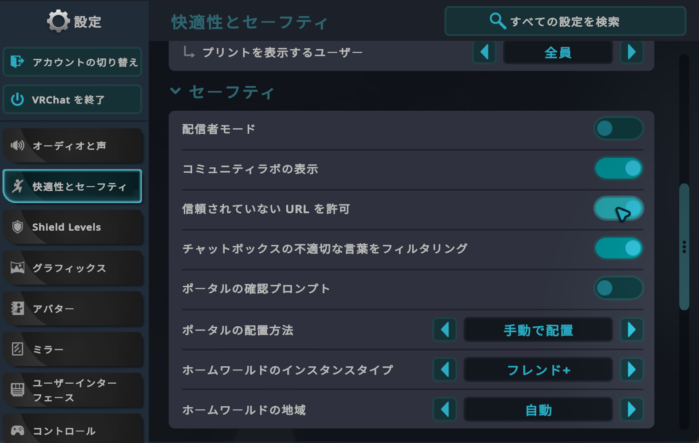
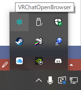
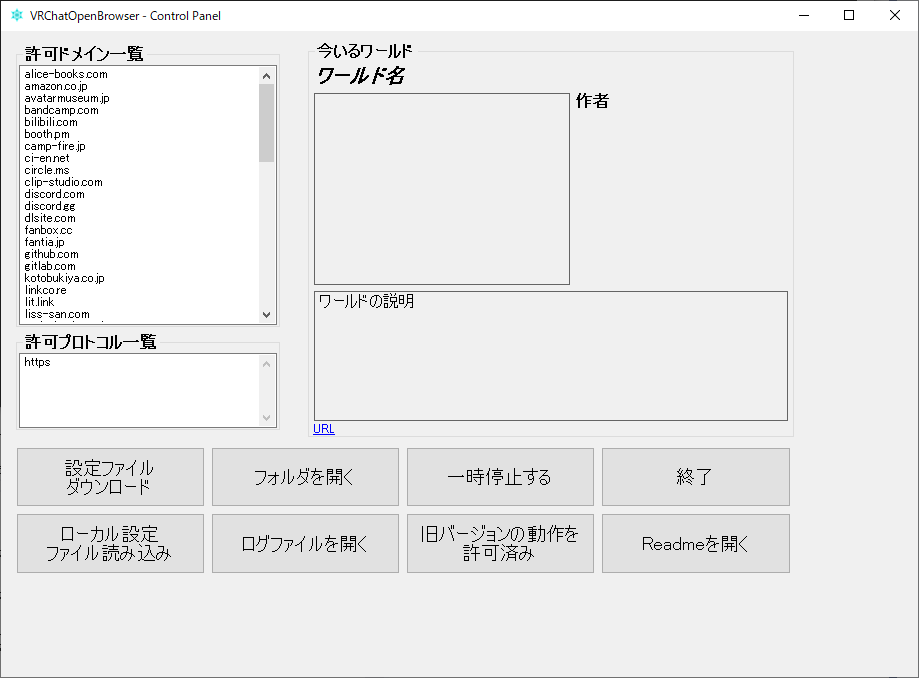
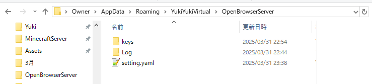

# VRChatOpenBrowser

## このツールについて
### VRChatからブラウザでURLを開く
VRChatのワールドギミックによって、デスクトップ上のブラウザでWebページを開くことが出来ます。メインの機能になります。  
（VRChat内で直接Webページを見るツールではありません）

### VRChatからこのアプリの情報を読み込む
VRChatのワールドギミックからStringDownloaderを使って、このアプリの情報をJSON型式で取得することが出来ます。アプリを起動した状態で[http://localhost:21983/](http://localhost:21983/)にアクセスしてください。

※ワールドアセットに含まれています。

### VRChatからファイルを読み込む
VRChatのワールドギミックから、このアプリを経由してテキストファイル、画像ファイル、動画ファイルなどを取得することが出来ます。アプリを起動した状態で[http://localhost:21983/keys/ファイル名](http://localhost:21983/keys/ファイル名)にアクセスしてください。  
ファイルは`%appdata%\YukiYukiVirtual\OpenBrowserServer\keys`に置いてください。  
日本語を含むテキストファイルを使いたい場合はUTF-16にしたら文字化けしないと思います。

※この機能は古い機能の互換性のためにありますが、需要が無かったためほぼ使われていないと思います。

## インストール
### 旧バージョン(v5.x.x以前)がある場合
本バージョンをインストールする前に、旧バージョンが動かないようにする必要があります。
1. タスクトレイのアイコンを右クリックし、終了してください。終了済みであれば結構です。
2. 必要に応じて（理由が無ければ）旧バージョンのフォルダを削除してください。
3. Windowsキー+Rキーを押して、`shell:startup`と入力して、スタートアップフォルダを開きます。
4. 旧バージョンのショートカットを削除してください。
5. 最新バージョンを新規インストールしてください。

### 新規インストール
1. zipファイルを解凍し、`setup.exe`を実行してください。項目はデフォルトでインストールしてください。
2. 通常はPC起動時に自動起動されるようになっています。初回起動時・自分でアプリを終了した時・アプリが落ちた時は、スタートメニューから`VRChatOpenBrowser.exe`を起動してください。
  - ポート番号の例外が発生した場合は、旧バージョンの終了がうまくいっていないかもしれません。パソコン再起動で直ります。
  - 二重起動はブロックされます。
3. VRChatで設定を開き、`信頼されていないURLを許可`を有効にしてください。

## アップデート
最新のインストーラーをダウンロードして、インストールしてください。

## アンインストール
Windowsの設定アプリからアプリのアンインストールを実行してください。  
設定ファイルやログファイルを`%appdata%\YukiYukiVirtual\OpenBrowserServer`に保存していますので、必要であればこちらも削除してください。

## 操作方法
### タスクトレイ

タスクトレイに雪のアイコンが表示されています。ダブルクリックでコントロールパネルが開きます。右クリックすることで実行できる項目もあります。
### 右クリックで実行できる項目
- Open Control Panel:
コントロールパネルを開きます。
- Update setting File:
設定ファイルをダウンロードして更新します。
- Open Folder:
`%appdata%\YukiYukiVirtual\OpenBrowserServer`フォルダを開きます。
- Exit:
このアプリを終了します。

### コントロールパネル

`許可ドメイン一覧`と`許可プロトコル一覧`は、現在許可されているものが表示されています。**設定ファイル**の章に詳しく載っています。  
ローカルの設定ファイルを編集して`ローカル設定ファイル読み込み`ボタンを押すと一時的に(起動中に)反映されます。追加依頼前に自分で確認するときなどにお使いください。

VRChatでワールド移動すると`今いるワールド`に反映されます。不安な動きをするワールドを報告するときなどにお使いください。  
※VRChatを起動してからこのアプリを起動すると、今現在いるワールドが`今いるワールド`に反映されませんが、このアプリはスタートアップで起動されることが標準と考えているため、反映されないのが仕様になります。

その他のボタンについてはマウスカーソルを乗せると説明が表示されます。

## BAN機能
このアプリに対して不安な動きをするワールドや、迷惑な動作をするワールドに入ってしまった際に、一時的に動作を停止する機能です。そのようなワールドがあった時は、報告していただくことでBANリストに追加します。  
報告の際は以下の情報をください。
- ワールドID
- ログファイル
- VRChatのログファイル
- どんな時に何が起こったか

## 設定ファイル
設定ファイルは基本的に変更する必要はなく、変更してもアプリ起動時に自動でダウンロードされます。

設定ファイルは`setting.yaml`という名前で`%appdata%\YukiYukiVirtual\OpenBrowserServer`フォルダにダウンロードされます。

### YAMLの項目
- Version:
アプリのバージョンです。

- IdlePeriod:
ブラウザを開く要求を聞く間隔(ミリ秒)です。

- HttpRequestPeriod:
HTTP要求を聞く間隔(ミリ秒)です。

- WatchdogTime:
VRChatが動いていないと判断する時間(分)です。

- Protocol:
ブラウザを開くことが出来るURLのプロトコル(スキーム)です。例:https

- Domain:
ブラウザを開くことが出来るURLのドメインです。サブドメインも開けるようになります。例:`yukiyukivirtual.net`を指定すると、`www.yukiyukivirtual.net`も開くことが出来ます。

- BannedUser:
登録されているユーザーのワールドに入った際に、コンピューターの保護のためにこのアプリの動作を一時停止します。  
ワールド作者の何らかのやらかしで、このアプリに対して不具合をきたす報告があった際に追加されることがあります。改善されると削除されることがあります。
  - Id:
BANするユーザーのIDです。
  - Reason:
BAN理由です。

## ログファイル
このアプリの起動時からの履歴を残したテキストファイルです。不具合報告などの時に送ってください。  
日付ごとに作成され、古いファイルから削除されます。最大10個保持されます。  
メモ帳などで開くことが出来ます。

## ワールドギミック(ワールド製作者向け)
いつか書きます

## 免責
このアプリを使用して発生したいかなる障害について、製作者は責任を負いません。

## 問い合わせ
- [Discord](https://discord.gg/9MwqEGvdTm)
- [GitHub](https://github.com/YukiYukiVirtual/OpenBrowserServer)  

イベント等で利用する際は、ぜひ教えてください！拡散に協力したいです。
こちらからのお知らせはDiscordサーバーでやります。必ず入っておいてください。  
不具合報告、デフォルトで許可してほしいドメイン名はここに報告お願いします。特に重大な欠陥などが見つかった際はすぐにお知らせください。  

### 不具合報告
このアプリのログと、VRChatのログをお送りください。個人情報や見せたくない情報がある場合は切り取ったり隠したりして送ってください。ただし、解析に支障がある場合は対応できない可能性があります。
